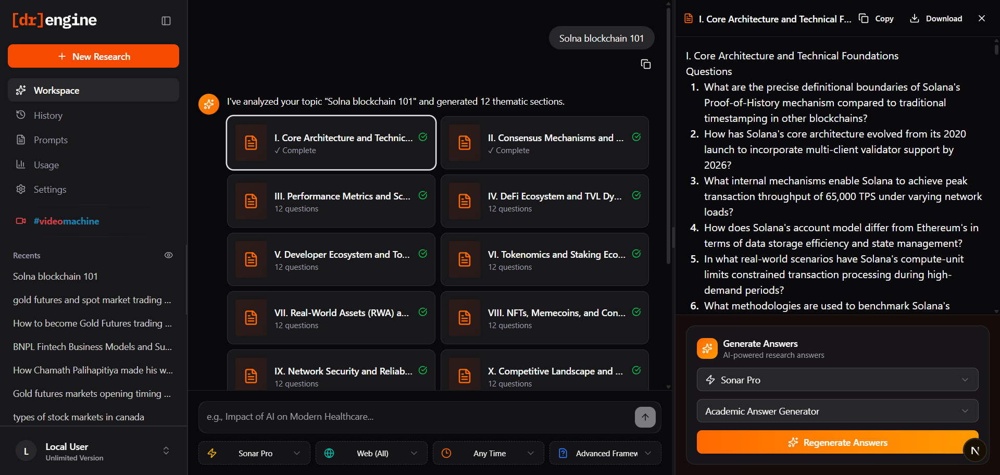

# [dr]engine

> **Deep Research Engine** - An AI-powered research framework generator that creates comprehensive research questions and answers using Perplexity AI.




## ✨ Features

- **AI-Powered Research Generation** - Generate structured research frameworks with themed questions
- **Bulk Answer Generation** - Automatic "Generate All Answers" feature for seamless research completion
- **Multiple AI Models** - Support for Sonar, Sonar Pro, Sonar Reasoning Pro, and Deep Research
- **Customizable Prompts** - Create and manage your own prompt templates
- **Section-by-Section Answers** - Generate detailed answers for each research section
- **Advanced Usage Tracking** - Monitor API usage with date/model filters and CSV export
- **Local & Private** - Everything runs on your device; data is stored locally using IndexedDB
- **Export Options** - Download research notes as markdown files

## 🛠️ Technology Stack

| Category | Technology |
|----------|------------|
| Framework | Next.js 16.1.1 |
| UI Library | React 19, Radix UI |
| Styling | Tailwind CSS 4 |
| Database | Dexie.js (IndexedDB) |
| AI Integration | Perplexity AI API |
| Animations | Framer Motion, GSAP |
| Language | TypeScript 5 |

## 📋 Prerequisites

- Node.js 18+ 
- npm or yarn
- Perplexity API Key ([Get one here](https://www.perplexity.ai/))

## 🚀 Getting Started

### Installation

```bash
# Clone the repository
git clone https://github.com/dinethlive/dr-engine.git

# Navigate to the project directory
cd dr-engine

# Install dependencies
npm install

# Start the development server
npm run dev
```

### Configuration

1. Open the app at `http://localhost:3000`
2. Go to **Settings**
3. Enter your Perplexity API key
4. Select your preferred AI model
5. Start researching!

## 📖 Documentation

| Document | Description |
|----------|-------------|
| [Technical Architecture](./docs/TECHNICAL.md) | Project structure and architecture |
| [Database Schema](./docs/DATABASE.md) | Database tables and relationships |
| [API Integration](./docs/API.md) | Perplexity AI integration details |
| [Documenting Prompts](./docs/PROMPTS.md) | **Critical:** Prompt Engineering Guidelines & strict parsing rules |
| [Contributing](./CONTRIBUTING.md) | Contribution guidelines |

## 📜 License

This project is licensed under **Creative Commons Attribution-NonCommercial 4.0 International (CC BY-NC 4.0)**.

- ✅ Personal use allowed
- ✅ Modification allowed
- ✅ Attribution required
- ❌ Commercial use prohibited

See [LICENSE](./LICENSE) for full details.

## 👏 Credits

- **Video Machine Program**: [malindaonline.me](https://www.malindaonline.me/)
- **Developer**: [Dineth Pramodya](https://dineth.lk/)

## 🔗 Links

- [GitHub Repository](https://github.com/dinethlive/dr-engine)
- [Report Issues](https://github.com/dinethlive/dr-engine/issues)
