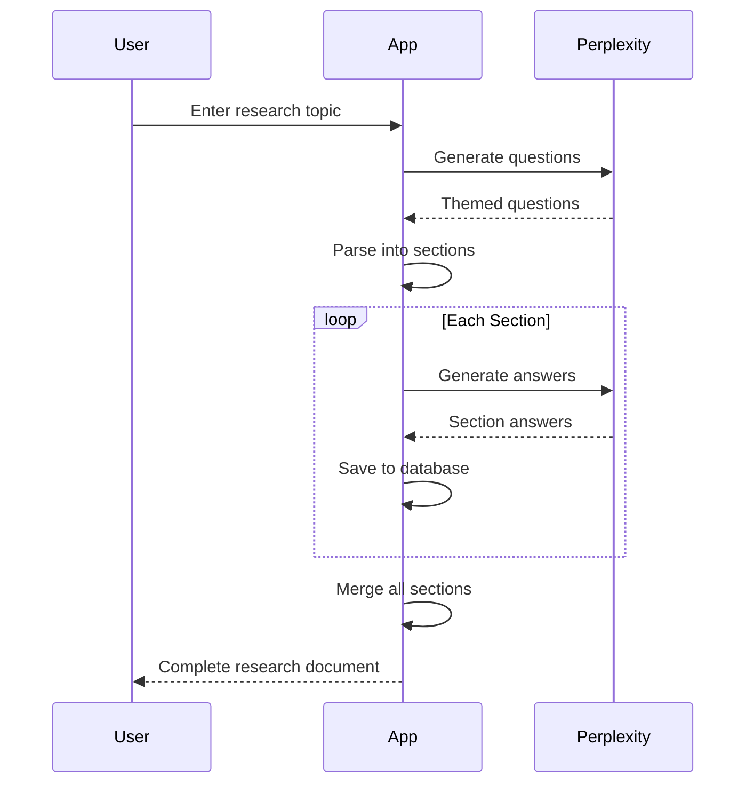

# API Integration

> DR-Engine integrates with **Perplexity AI** for generating research questions and answers.

## Perplexity AI

### Configuration

API calls are made to: `https://api.perplexity.ai/chat/completions`

Store your API key in Settings → API Key.

---

### Supported Models

| Model | Input Cost | Output Cost | Best For |
|-------|------------|-------------|----------|
| `sonar` | $1/M tokens | $1/M tokens | Quick queries |
| `sonar-pro` | $3/M tokens | $15/M tokens | Detailed research |
| `sonar-reasoning-pro` | $2/M tokens | $8/M tokens | Complex reasoning |
| `sonar-deep-research` | $2/M tokens | $8/M tokens | In-depth analysis |

*M = Million tokens*

---

### API Request Format

```typescript
interface PerplexityRequest {
  model: string;
  messages: {
    role: "system" | "user" | "assistant";
    content: string;
  }[];
  max_tokens?: number;      // Default: 16000
  temperature?: number;     // Default: 0.2
  search_recency_filter?: string;
  search_domain_filter?: string[];
}
```

### API Response Format

```typescript
interface PerplexityResponse {
  id: string;
  model: string;
  choices: {
    index: number;
    message: {
      role: string;
      content: string;
    };
    finish_reason: string;
  }[];
  usage: {
    prompt_tokens: number;
    completion_tokens: number;
    total_tokens: number;
  };
}
```

---

## Prompt Templates

### Question Generation

Variables: `{topic}`

Generates themed research questions organized by category.

### Answer Generation  

Variables: `{topic}`, `{theme_title}`, `{questions}`

Generates comprehensive answers for each question set.

---

## Workflow Process



---

## Error Handling

| Error | Cause | Solution |
|-------|-------|----------|
| 401 Unauthorized | Invalid API key | Check Settings |
| 429 Rate Limited | Too many requests | Wait and retry |
| 500 Server Error | API issue | Retry later |

Errors are caught and displayed to the user with retry options.

---

## Usage Tracking

Each API call automatically logs:
- Token counts (input/output)
- Calculated cost
- Model used
- Associated workflow

View usage in the **Usage** page.
