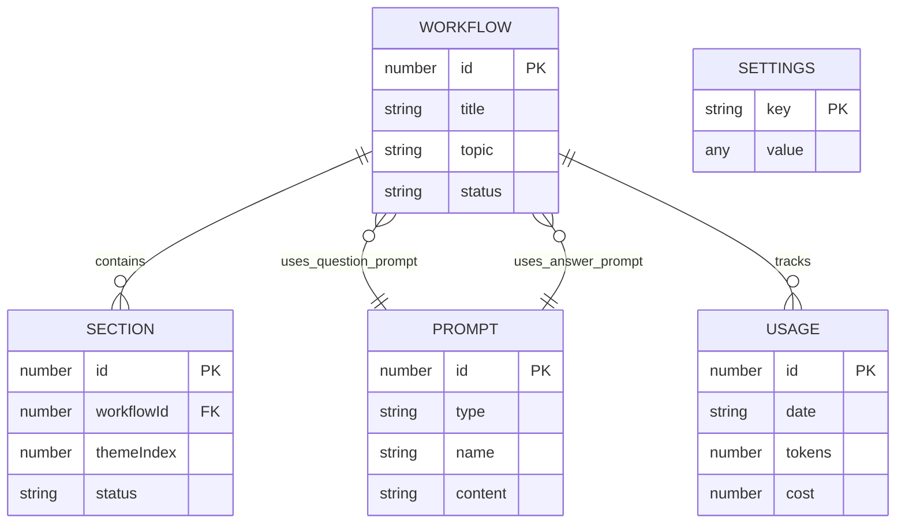

# Database Schema

> DR-Engine uses **Dexie.js** (IndexedDB wrapper) for client-side persistent storage. All data remains on the user's device.

## Overview

| Table | Purpose | Primary Key |
|-------|---------|-------------|
| `prompts` | Prompt templates | Auto-increment ID |
| `workflows` | Research sessions | Auto-increment ID |
| `sections` | Workflow sections | Auto-increment ID |
| `settings` | App configuration | String key |
| `usage` | API usage tracking | Auto-increment ID |

---

## Tables

### Prompts

Stores custom prompt templates for question/answer generation.

```typescript
interface Prompt {
  id?: number;           // Auto-generated
  type: string;          // "question" | "answer"
  name: string;          // Template name
  content: string;       // Prompt text with variables
  createdAt: Date;
  updatedAt: Date;
}
```

**Indexes**: `type`, `name`, `createdAt`

**Variables**: `{topic}`, `{theme_title}`, `{questions}`

---

### Workflows

Stores research workflow sessions with status tracking.

```typescript
interface Workflow {
  id?: number;
  title: string;                    // Workflow display name
  topic: string;                    // Research topic
  status: WorkflowStatus;           // Current state
  createdAt: Date;
  updatedAt: Date;
  questionPromptId?: number | string;
  answerPromptId?: number | string;
  modelId?: string;                 // AI model used
  questionsJson?: string;           // Generated questions
  mergedContent?: string;           // Final merged document
  options?: PerplexityOptions;      // API options
}

type WorkflowStatus = 
  | "CREATED"
  | "QUESTIONS_GENERATING"
  | "QUESTIONS_READY"
  | "ANSWERS_GENERATING"
  | "COMPLETED"
  | "FAILED";
```

**Indexes**: `status`, `createdAt`

---

### Sections

Stores individual sections within a workflow.

```typescript
interface Section {
  id?: number;
  workflowId: number;      // FK to Workflow
  themeIndex: number;      // Order index
  themeTitle: string;      // Section title
  themeMetadata?: string;  // JSON metadata
  questionsJson: string;   // Questions array (JSON)
  answersJson?: string;    // Answers array (JSON)
  status: SectionStatus;
  modelId?: string;
  answerPromptId?: number | string;
  retryCount: number;
  errorMessage?: string;
  createdAt: Date;
  updatedAt: Date;
  completedAt?: Date;
}

type SectionStatus = "PENDING" | "IN_PROGRESS" | "COMPLETED" | "FAILED";
```

**Indexes**: `workflowId`, `status`, `themeIndex`

---

### Settings

Key-value store for application settings.

```typescript
interface Setting {
  key: string;    // Primary key (e.g., "apiKey", "defaultModel")
  value: any;     // Setting value
}
```

**Common Keys**:
- `apiKey` - Perplexity API key
- `defaultModel` - Default AI model

---

### Usage

Tracks API usage and costs.

```typescript
interface Usage {
  id?: number;
  date: string;           // YYYY-MM-DD
  tokens: number;         // Total tokens
  inputTokens: number;    // Prompt tokens
  outputTokens: number;   // Completion tokens
  cost: number;           // USD cost
  model: string;          // Model used
  workflowId?: number;    // Related workflow
  workflowName?: string;  // Workflow display name
}
```

**Indexes**: `date`, `model`

---

## Entity Relationship



---

## Schema Versions

| Version | Changes |
|---------|---------|
| 1 | Initial: prompts, workflows, settings, usage |
| 2 | Added sections table |
| 3 | Enhanced usage with workflow tracking |

---

## Usage Examples

```typescript
import { db } from "@/lib/db";
import { useLiveQuery } from "dexie-react-hooks";

// Get all workflows
const workflows = useLiveQuery(() => 
  db.workflows.orderBy("createdAt").reverse().toArray()
);

// Get sections for a workflow
const sections = useLiveQuery(() => 
  db.sections.where("workflowId").equals(workflowId).toArray()
);

// Save a setting
await db.settings.put({ key: "apiKey", value: "your-key" });

// Get a setting
const setting = await db.settings.get("apiKey");
```
